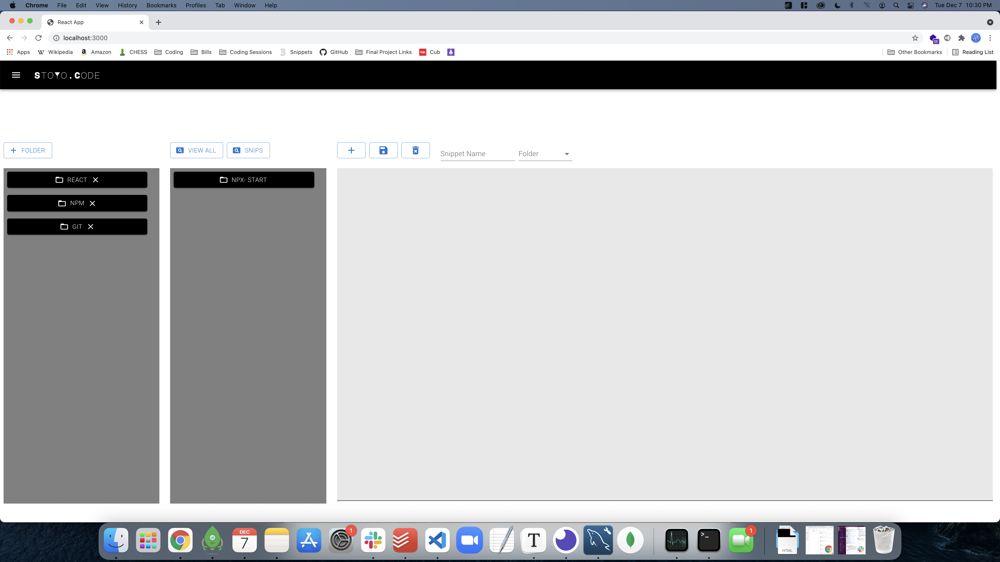

# StoYoCode

[Here is the link to the deployed site.](https://stoyocode2.herokuapp.com/)

## Description 
As a developer, there are many times when we just need to copy and paste code that we use consistantly. Our web app creates an environment to organize and store the needed code. Save time and frustration searching through notebooks by saving your code directly into a folder you created!

## Demo 

## Table of Contents
* [Technologies used](#technologies-used)
* [Contributions](#Contributions)
* [Credits](#Credits)
* [Contact](#Contact)

## Technologies used
  - JSX
  - CSS
  - Material UI
  - React
  - Node.js
  - Express.js
  - JWT
  - Apollo Server
  - GraphQL
  - Mongoose
  - MongoDB
  - Heroku 

## Contributions
  *Brendan Smith*

  *Jack Goers*

  *Christian Schoen*

  *Shawn McWhorter*

## Credits
  Special thank to Chris Woolcot, Nathan Perfetti, and Phillip Merriman Jr. for their invaluable assistance. 

## Contact
If you have any questions, feel free to cantact us at: 
  * https://github.com/Brendan838
  * https://github.com/Jackgoers96
  * https://github.com/Schoen9576
  * https://github.com/Rhandom1

  With honroary mention to Josh Rist, who was there at the founding of 5 Guys Coding!